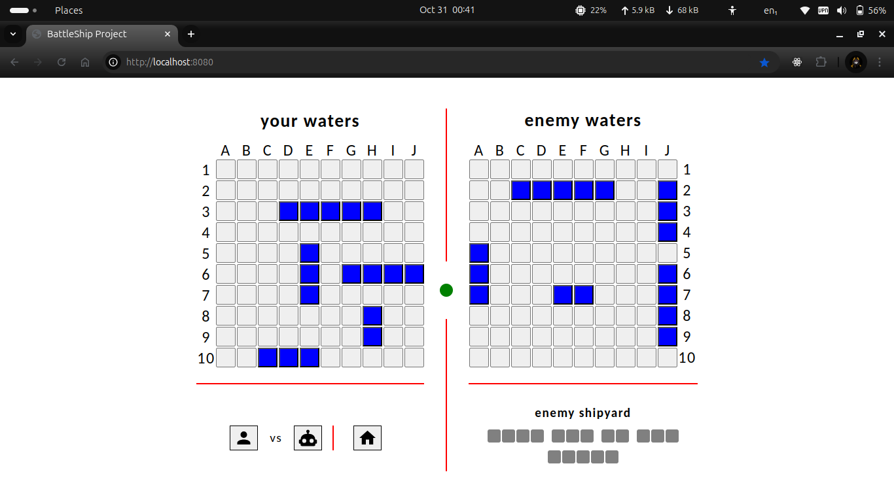

# PROJECT BATTLESHIP GAME

A modern, full-stack implementation of the classic Battleship game with real-time multiplayer capabilities, built using Test-Driven Development (TDD) principles.



## 🏗️ Architecture

This project uses a split architecture optimized for modern deployment:

- **Frontend**: Static React-like web app deployed on **Netlify**
- **Backend**: Node.js API server with Socket.IO deployed on **Render**

## 🚀 Quick Start

### Local Development

**Option 1: Automated (Windows)**
```cmd
start-dev.bat
```

**Option 2: Manual**
```cmd
# Terminal 1 - Backend (Port 3001)
cd backend
npm install
npm run dev

# Terminal 2 - Frontend (Port 8080)
cd frontend  
npm install
npm run dev
```

Access the game at `http://localhost:8080`

### Production Deployment

#### 🌐 Frontend (Netlify)

1. **Prepare for deployment:**
   ```cmd
   cd frontend
   npm install
   npm run build
   ```

2. **Deploy to Netlify:**
   - Connect your GitHub repository to Netlify
   - Build command: `npm run build`
   - Publish directory: `dist`
   - Environment variables: Set `BACKEND_URL` to your Render backend URL

#### ⚡ Backend (Render)

1. **Prepare for deployment:**
   ```cmd
   cd backend
   npm install
   ```

2. **Deploy to Render:**
   - Connect your GitHub repository to Render
   - Build command: `npm install`
   - Start command: `npm start`
   - Environment variables:
     - `MONGODB_URI`: Your MongoDB connection string
     - `JWT_SECRET`: Your JWT secret key
     - `NODE_ENV=production`
     - `PORT=10000` (Render default)

## 🎮 About the Game

**Battleship Game** is a full-stack JavaScript application that modernizes the classic naval strategy game. Built with TDD principles, it features real-time multiplayer gameplay, intelligent AI opponents, and a responsive web interface.

### Key Features

- **🔥 Real-time Multiplayer**: WebSocket-based gameplay with instant updates
- **🤖 Smart AI Opponents**: Multiple difficulty levels with adaptive strategies  
- **⚓ Dynamic Ship Placement**: Manual positioning or auto-placement options
- **👤 User Management**: Registration, authentication, and persistent statistics
- **📱 Responsive Design**: Optimized for desktop and mobile devices
- **📊 Game Analytics**: Track wins, losses, and achievement progress
- **⚙️ Customization**: Personalize settings and game preferences

## 📁 Project Structure

```
Battleship/
├── 🎨 frontend/              # Static web application (Netlify)
│   ├── src/
│   │   ├── battleship.js     # Core game logic
│   │   ├── dom_module/       # UI components
│   │   ├── helper_module/    # Utility functions
│   │   ├── services/         # API integration
│   │   └── config/           # Environment configuration
│   ├── webpack.*.js          # Build configuration
│   ├── package.json          # Frontend dependencies
│   └── netlify.toml          # Deployment settings
├── 🖥️ backend/               # API server (Render)
│   ├── controllers/          # Request handlers
│   ├── models/              # Database schemas
│   ├── routes/              # API endpoints
│   ├── index.js             # Server entry point
│   ├── package.json         # Backend dependencies
│   └── render.yaml          # Deployment configuration
├── 🧪 __tests__/            # Test suites
├── 📋 start-dev.bat         # Local dev launcher
└── 📖 README.md            # This file
```

## 🛠️ Built With

### Frontend Stack
- **JavaScript (ES6+)** - Modern JavaScript features
- **Webpack** - Module bundling and build system
- **Socket.IO Client** - Real-time communication
- **HTML5 & CSS3** - Responsive UI/UX
- **Jest** - Unit testing framework

### Backend Stack  
- **Node.js & Express.js** - Server runtime and framework
- **Socket.IO Server** - WebSocket communication
- **MongoDB & Mongoose** - Database and ODM
- **JWT** - Authentication tokens
- **CORS** - Cross-origin resource sharing

## 🧪 Testing

Run the comprehensive test suite:

```cmd
# Frontend tests
cd frontend
npm test

# Backend tests  
cd backend
npm test

# Run all tests
npm run test:all
```

## 🤝 Contributing

Contributions are welcome! Please follow these steps:

1. **Fork** the repository
2. **Create** a feature branch (`git checkout -b feature/amazing-feature`)
3. **Commit** your changes (`git commit -m 'Add amazing feature'`)
4. **Push** to the branch (`git push origin feature/amazing-feature`)
5. **Open** a Pull Request

## 📋 Development Roadmap

### 🔍 Testing & Quality
- [ ] Comprehensive test coverage for `GameController` and `GameRound`
- [ ] End-to-end testing for multiplayer scenarios
- [ ] API endpoint integration tests
- [ ] Performance benchmarking

### 🎯 Game Features
- [ ] Advanced AI with machine learning capabilities
- [ ] Tournament mode with bracket system
- [ ] Spectator mode for live games
- [ ] Game replay and analysis tools
- [ ] Custom game rules and variants

### 🎨 User Experience  
- [ ] Background music and sound effects
- [ ] Advanced visual themes and animations
- [ ] Comprehensive leaderboards and rankings
- [ ] Achievement system with unlockables
- [ ] Social features and friend lists

### ⚡ Technical Improvements
- [ ] Real-time state synchronization optimization
- [ ] Mobile app development (React Native)
- [ ] Performance caching and CDN integration
- [ ] Multi-language internationalization (i18n)
- [ ] Progressive Web App (PWA) features

## 📜 License

This project is licensed under the [MIT License](./LICENSE) - see the file for details.

## 🙏 Acknowledgments

- **[The Odin Project](https://www.theodinproject.com/)** - Educational curriculum and guidance
- **[Material Design Icons](https://pictogrammers.com/library/mdi/)** - Icon library
- **Classic Battleship Game** - Original concept and inspiration

---

**Live Demo**: [Coming Soon] | **Report Bug** | **Request Feature**

Made with ❤️ for The Odin Project
